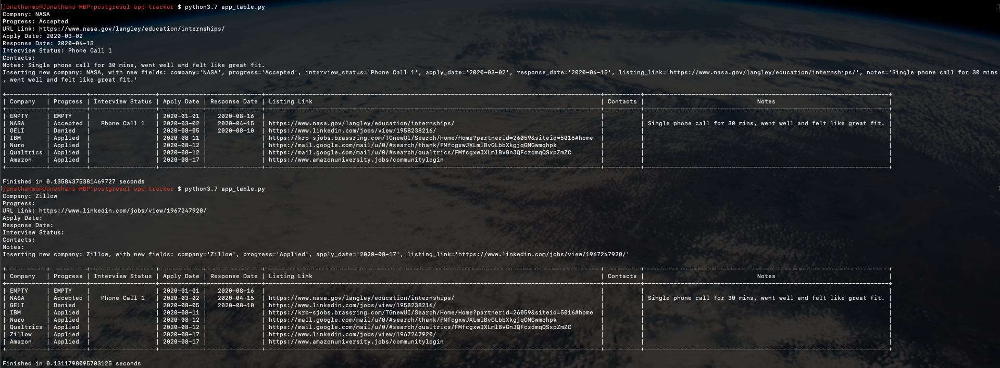

# postgresql-app-tracker
A PostgreSQL and Python database and UI system to track application statuses.

PostgreSQL Application Tracker
======================
1. [Introduction](#introduction-)
2. [Project Layout](#project-layout-)
3. [Installation](#installation-)

Introduction [^](#postgresql-application-tracker)
------------

The purpose of this wiki page is to help users and viewers understand the layout of the 
repository. PostgreSQL and Python are required to run.

Project Layout [^](#postgresql-application-tracker)
--------------

The project is laid out in a single folder with two Python source files and a requirements.txt file

-   application.py
    - This Python file contains the Application class
    - Initializes an Application object which holds the company, progress, interview status, application date, response date, listing link, as well as contacts and notes if any.
-   app_table.py
    - Connects the the already created database and table in PostgreSQL.
    - Inserts, removes, or modifies applications within the table.
-   requirements.txt (contains the necessary Python packages to run)
    
    
Installation [^](#postgresql-application-tracker)
------------
To install Python, follow the [python.org](python.org) tutorial to install the correct version of Python.
Next make sure pip is installed on your machine, and then run `pip install -r requirements.txt` to make sure all necessary packages are installed.

To install PostgreSQL, follow the [https://www.postgresql.org/download/](postgresql.org/download) tutorial to download based on the operating system.

Once installed, run `psql postgres` in a command line to activate a psql terminal. 

Next run `CREATE DATABASE <dbname>` to create the given database.

Running `\c <dbname>` should connect you to the database as your current user.

To create the table, `CREATE TABLE apps_2020_2021 (Company VARCHAR,
Progress VARCHAR,
Interview_Status VARCHAR,
Apply_Date VARCHAR,
Response_Date VARCHAR,
Listing_Link VARCHAR,
Contacts VARCHAR,
Notes VARCHAR);` should create the table with all the necessary columns and column types.

Now back in the command line with the same directory as 'app_table.py', running `python app_table.py` will let you input values.

The only required field to create a new entry is company, and the table will be printed out afterwards.
Leaving all the inputs blank will print out the table as well.

Note: Users may have to run chmod +x on the python scripts to allow them to be run as executables
